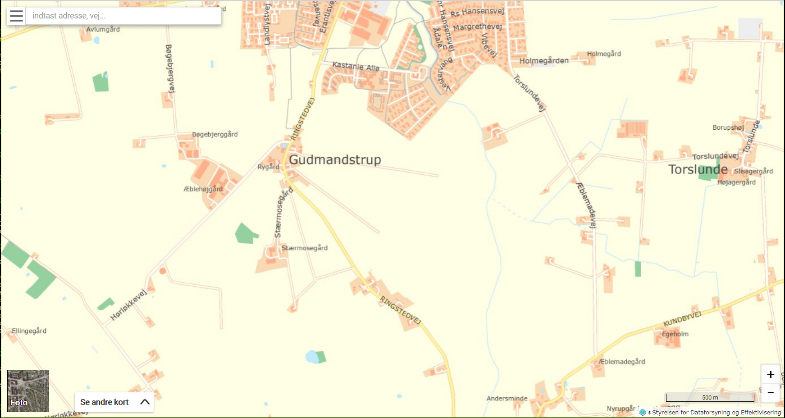
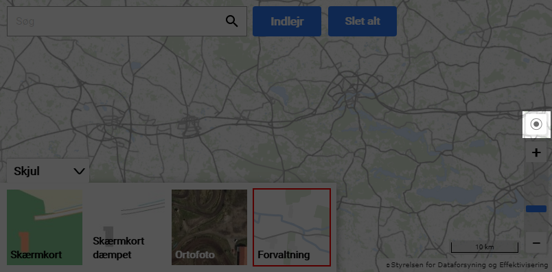
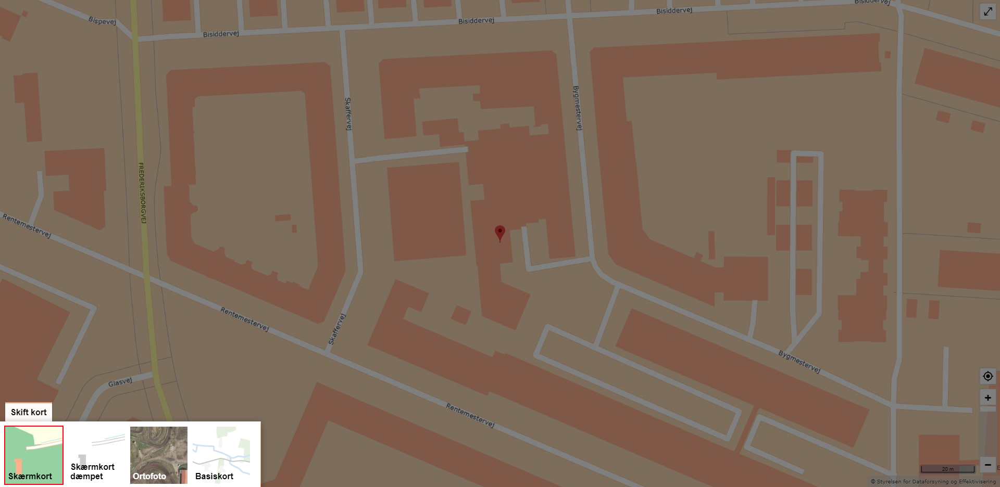
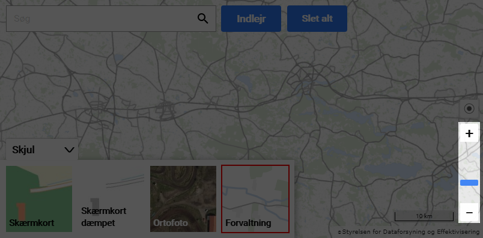

# SDFEMap - et kortmodul til indlejring

[Kortforsyningen](https://kortforsyningen.dk) har udviklet et modul til indlejring af baggrundskort på hjemmesider. Modulet er tiltænkt webudviklere der har brug for en let implementerbar og fleksibel kortvisning på egen hjemmeside.

Modulet er implementeret i Javascript, og er baseret på [OpenLayers](https://openlayers.org/).

Før brug, skal man oprette en bruger på Kortforsyningen: <https://download.kortforsyningen.dk/user/create-profile>.

Derefter skal man oprette en token: <https://www.kortforsyningen.dk/indhold/min-side-0>

<p align="center"></p>

## Overblik

Modulet har følgende delkomponenter, som alle kan aktiveres eller deaktiveres:

### Min position

En knap, der forsøger at vise din position på kortet.

<p align="center"></p>

### Kortvælger

Giver mulighed for at vælge imellem et par forskellige baggrundskort.

<p align="center"></p>

### Zoomslider

Viser et panel med zoomniveauer, og en zoom ind- og udknap.

<p align="center"></p>

## Installation

### CDN

Du kan indlæse Javascript-biblioteket på din hjemmeside, ved at skrive denne linje i din HTML (se eksempel: `examples/all.html`):

```html
<script src="https://apps.kortforsyningen.dk/cms-map-js/js/SDFEMap.min.js"></script>
```

### Lokal kopi

Du kan også vælge at downloade filen til din egen server, og inkludere den derfra (se eksempel: `examples/none.html`).

Download filen: `https://apps.kortforsyningen.dk/cms-map-js/js/SDFEMap.min.js` og læg den et sted hvor din hjemmeside kan tilgå den. Indsæt derefter følgende i din HTML.

```html
<script src="/path/to/SDFEMap.js"></script>
```

## Anvendelse

### Parametre

Der kan sættes et antal parametre, som styrer udseendet af det kortet. Her er et kode-eksempel på hvordan det kan se ud. (se eksempler i mappen `examples`).

```html
<div id="map">
<script src="https://apps.kortforsyningen.dk/kortviserIndlejring/js/SDFEMap.min.js"></script>

<!-- The map object -->

<span 
  id="unique-id"
  class="geomap" 
  data-type="atm,bank"
  data-zoom="auto" 
  data-center-lat="" 
  data-center-lon=""
  data-background="orto_foraar"
  data-mylocation="true"
  data-zoomslider="true"
  data-layerswitcher="true"
  data-token="yourTokenHere">
</span>

<!-- Marker objects -->

<span 
  class="geomarker" 
  data-type="bank"
  data-title="Bank" 
  data-link="https://..." 
  data-description="A bank"
  data-lat="" 
  data-lon="">
</span>

<span 
  class="geomarker" 
  data-type="atm"
  data-title="ATM" 
  data-link="https://..." 
  data-description="An atm"
  data-lat="" 
  data-lon="">
</span>

<script>
    var map = new SDFEMap.initialize();
</script>
```

Følgende parametre kan anvendes i et kort-object (class: `geomap`):

#### `data-type`

Angiver hvilke markør-typer, der skal vises på kortet. Hvis man fx har både banker med `data-type="bank"`, og hæveautomater med `data-type="atm"`, kan man vise den ene type med:

`data-type="bank"`

eller begge typer med:

`data-type="atm,bank"`

#### `data-zoom`

Angiv zoomniveau i heltal, for at sætte et specifikt zoom-niveau. Hvis den sættes til `auto`, vil kortet selv prøve at finde et passende zoom-niveau, hvor alle punkter er med i kortet.
Mulige værdier: 0-13, auto.

Hvis sat til `auto`, behøves `data-center-lat` og `data-center-lon` ikke at blive udfyldt.

#### `data-center-lat` og `data-center-lon`

Angiv centerpunkt for kortet. Et koordinatpar i `WGS84` aka `epsg:4326`
Eksempelvis: `data-lat="55.5"` og `data-lon="11.5"`.

Disse er ikke relevante, hvis `data-zoom` har værdien `auto`.

#### `data-background`

Man kan vælge imellem disse fire forskellige baggrundskort:

- `dtk_skaermkort`        (Almindeligt skærmkort)
- `dtk_skaermkort_daempet` (Dæmpet skærmkort)
- `forvaltning`           (Kort til forvaltning - uden navne)
- `orto_foraar`           (ortofoto)

#### `data-searchbar`

Angiver om søgefeltet bliver vist oppe i venstre hjørne eller ej.

#### `data-mylocation`

Angiv om knap til Min Position skal vises.
Mulige værdier: `true` , `false`. Standard = `true`.

#### `data-zoomslider`

Angiv om Zoomslider skal vises.
Mulige værdier: `true` , `false`. Standard = `true`.

#### `data-layerswitcher`

Angiv om funktionen Kortvælger skal vises.
Mulige værdier: `true` , `false`. Standard = `true`.

#### `data-token`

Angiv Kortforsyningen token til autentificering.

Følgende parametre kan anvendes i et markør-object (class: `geomarker`):

#### `data-type`

Angiver hvilken markør-type det skal være. Det kunne fx være `atm` eller `bank`. Dette kan især være smart hvis man skal vise flere kort på samme side.

#### `data-title`

Angiver titlen på markøren. Kommer frem i popup-boksen.

#### `data-description`

Angiver beskrivelsen eller brødteksten på markøren. Kommer frem i popup-boksen.

#### `data-lat` og `data-lon`

Angiver koordinaterne til markøren. Et koordinatpar i `WGS84` aka `epsg:4326`.

```
data-lat="55.5123"
data-lon="11.5432"
```

## Fremsøgning af koordinater

For at finde koordinater til en adresse kan du bruge [OpenStreetMap](https://www.openstreetmap.org) eller [Google Maps](https://maps.google.com). Du kan også bruge API'et til Danmarks AdresseRegister igennem [DAWA-AWS](https://dawa.aws.dk), dette er nok det smarteste valg, hvis man vil lave automatiseret adressesøgning via et API.


### OpenStreetMap

På [OSM](https://www.openstreetmap.org) kan du søge efter din adresse, hvorefter du højreklikker og vælger `Vis adresse`.

Herefter vil koordinaterne fremgå i venstre side af skærmen. Se screendump. Det første tal er breddegrad (lat) og det næste tal er længdegrad (lon).

<p align="center"></p>


### Google

På [GoogleMaps](https://maps.google.com) kan du søge efter din adresse, hvorefter du højreklikker og vælger `Hvad er der her?`. Så vil der komme en lille boks op nederst i midten af skærmen. Tryk på tallene i boksen. (se screendump).

<p align="center"></p>

Herefter vil koordinaterne fremgå i venstre side af skærmen. Se screendump. Det første tal er breddegrad (lat) og det næste tal er længdegrad (lon).

<p align="center"></p>


### DAWA-AWS

Her er et eksempel på en adresse, som vi får et koordinat på igennem AWS:

http://dawa.aws.dk/adresser?q=rentemestervej%208,%202400&format=geojson&struktur=mini

Returnerer en samling adresser, hvor koordinaterne står i `geometry.coordinates`:

<p align="center"></p>


### Omregning til decimalgrader

Hvis man ikke har decimalgrader i `WGS84`, kan man transformere dem ved hjælp af Kortforsyningens service: RestGeoKeys. ([Læs mere her](https://kortforsyningen.dk/indhold/geonoegler-rest#koortrans)).

Her er en eksempel-url, man kan sende af sted. Man skal dog indsætte sin egen token først:

https://services.kortforsyningen.dk/?servicename=RestGeokeys_v2&method=koortrans&ingeoref=EPSG:25832&ingeop=550000,6220000&outgeoref=EPSG:4326&token=insertYourToken


## Eksempler

--

## Hvad der er bundlet i biblioteket

- Openlayers

## Versioner af OpenLayers

SDFEMap | OpenLayers
--------|-----------
   1.0  |       5.3
