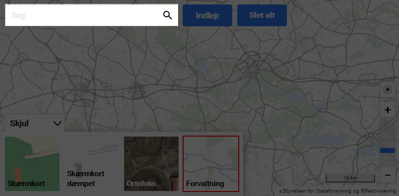

# BETA TEST  <br/>


## SDFEMap - et kortmodul til indlejring

[Kortforsyningen](https://kortforsyningen.dk) har udviklet et modul til indlejring af baggrundskort på hjemmesider. Modulet er tiltænkt webudviklere der har brug for en let implementerbar og fleksibel kortvisning på egen hjemmeside.

Modulet er implementeret i Javascript, og er baseret på [OpenLayers](https://openlayers.org/).

Før brug, skal man oprette en bruger på Kortforsyningen: <https://download.kortforsyningen.dk/user/create-profile>.

Derefter skal man oprette en token: <https://kortforsyningen.dk/indhold/login-https-og-ssl>

<p align="center"></p>

## Overblik

Modulet har følgende delkomponenter, som alle kan aktiveres eller deaktiveres:

### Søgefelt

Viser et søgefelt, hvor man kan søge (via [Geosearch](https://kortforsyningen.dk/indhold/geonoegler-geosearch)) efter adresser.

<p align="center"></p>

### Min position

En knap, der forsøger at vise din position på kortet.

<p align="center"></p>

### Kortvælger

Giver mulighed for at vælge imellem et par forskellige baggrundskort.

<p align="center"></p>

### Zoombar

Viser et panel med zoomniveauer, og en zoom ind- og udknap.

<p align="center"></p>

## Installation

### CDN

Du kan indlæse Javascript-biblioteket på din hjemmeside, ved at skrive denne linje i din HTML (se eksempel: `examples/all.html`):

```html
<script src="https://apps.kortforsyningen.dk/kortviserIndlejring/js/SDFEMap.min.js"></script>
```

### Lokal kopi

Du kan også vælge at downloade filen til din egen server, og inkludere den derfra (se eksempel: `examples/none.html`).

Download filen: `https://apps.kortforsyningen.dk/kortviserIndlejring/js/SDFEMap.min.js` og læg den et sted hvor din hjemmeside kan tilgå den. Indsæt derefter følgende i din HTML.

```html
<script src="/path/to/SDFEMap.js"></script>
```

## Anvendelse

### Parametre

Der kan sættes et antal parametre, som styrer udseendet af kortet. Her er et kode-eksempel på hvordan det kan se ud. (se eksempler i mappen `examples`).

```html
<div id="map">
<script src="https://apps.kortforsyningen.dk/kortviserIndlejring/js/SDFEMap.min.js"></script>
<script>
  var map = new SDFEMap.map({
    target: 'map',
    token: 'InsertYourTokenHere',
    background: 'orto_foraar',
    zoomSlider: true,
    searchBar: true,
    myLocation: true,
    layerSwitcher: true,
    view: {
      center: [574762, 6220951],
      zoom: 11
    }
  })
```

Følgende parametre kan anvendes i SDFEMap :

#### `target`

Angiv den HTML `div` id du vil vise løsningen i. Standard = `map`.

#### `token`

Angiv Kortforsyningen token til autentificering.

#### `background`

Man kan vælge imellem disse fire forskellige baggrundskort:

- `dtk_skaermkort`        (Almindeligt skærmkort)
- `dtk_skaermkort_daempet` (Dæmpet skærmkort)
- `forvaltning`           (Kort til forvaltning - uden navne)
- `orto_foraar`           (ortofoto)

#### `zoomSlider`

Angiv om Zoombaren skal vises.
Mulige værdier: `true` , `false`. Standard = `true`.

#### `searchbar`

Angiv om søgefelt skal vises.
Mulige værdier: `true` , `false`. Standard = `true`.

#### `myLocation`

Angiv om knap til Min Position skal vises.
Mulige værdier: `true` , `false`. Standard = `true`.

#### `layerSwitcher`

Angiv om funktionen Kortvælger skal vises.
Mulige værdier: `true` , `false`. Standard = `true`.

#### `view.center`

Angiv centerpunkt for kortet. Et koordinatpar i UTM32+ETRS89/EPSG:25832.
Eksempelvis: `center: [574762, 6220951]`

#### `view.zoom`

Angiv zoomniveau i heltal.
Mulige værdier: 0-13.

## Eksempler

Se filer med eksempler i mappen [`examples`](https://github.com/Kortforsyningen/apps_and_utilities_til_kfwebhotel/tree/indlejring/apps/SDFEMapLibrary/examples).

Der er både en fil, der benytter Kortforsyningens CDN, og en fil, hvor man har hentet biblioteket ned lokalt.

## Hvad der er bundlet i biblioteket

- Openlayers
- jQuery
- Bootstrap
- Bootstrap-3-typeahead

## Versioner af OpenLayers

SDFEMap | OpenLayers
--------|-----------
   1.0  |       5.3
